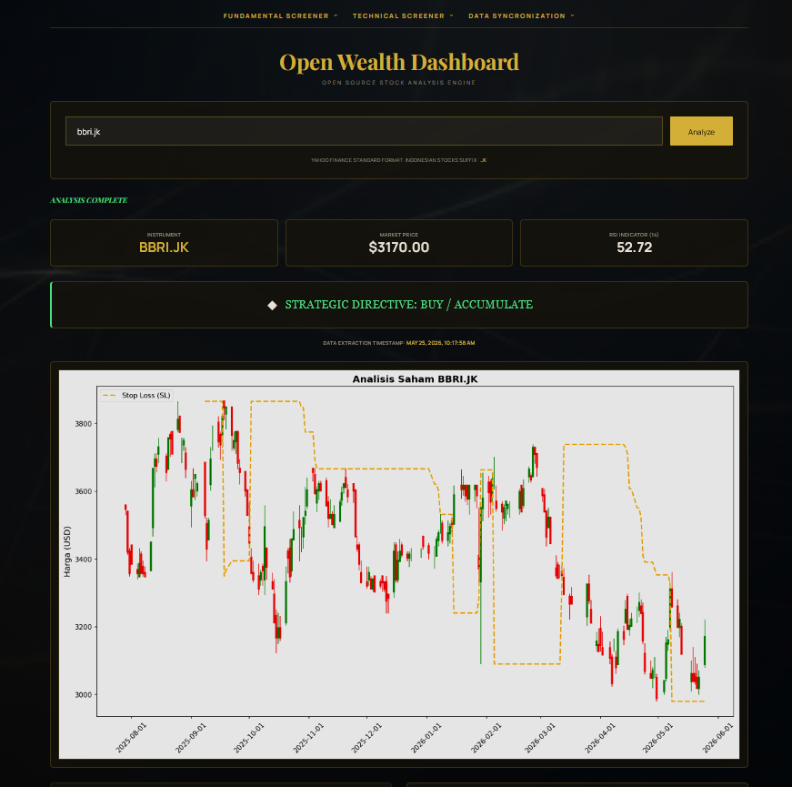
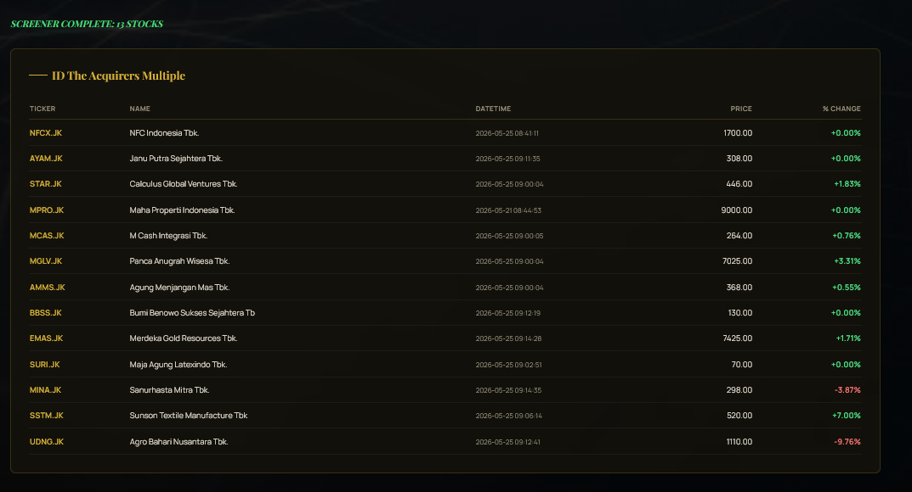
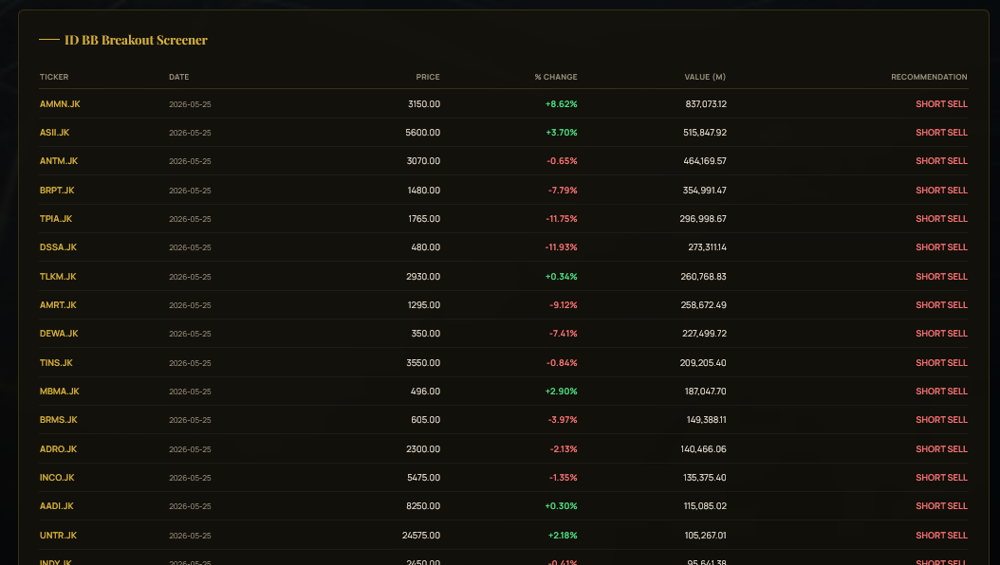
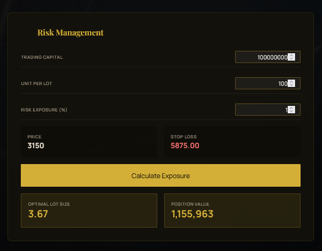
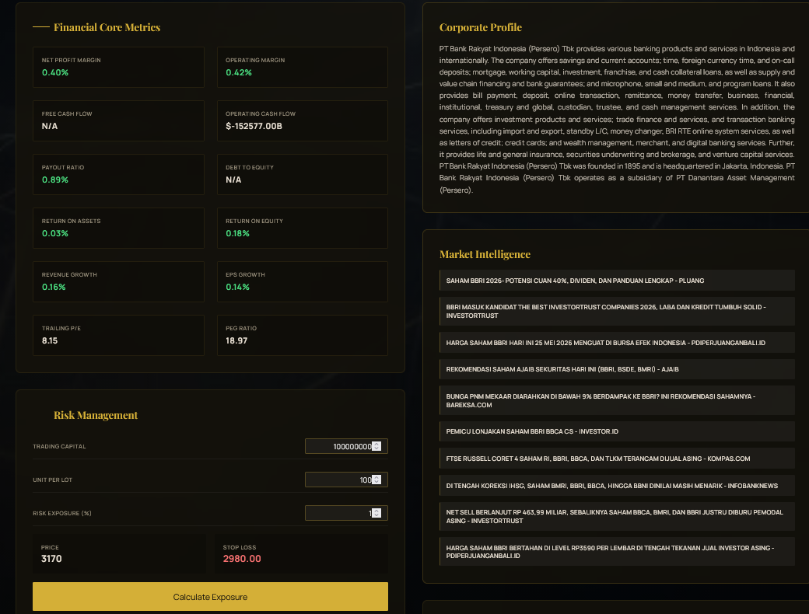
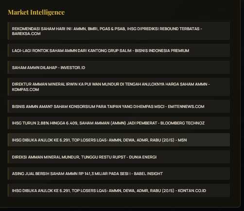

# Open Wealth Dashboard

Open-source stock analysis engine for US and Indonesian (IDX) markets. Built with Flask + vanilla JS, data sourced entirely from Yahoo Finance.

## Features

- **Stock Analyzer** — RSI (14), Donchian Channel Stop Loss, candlestick chart, BUY/HOLD/SELL recommendation

- **Fundamental Screeners** — Most Active, Day Gainers, Net Net Strategy, Acquirers Multiple (both US & ID)

- **Technical Screener** — Bollinger Band Breakout screener against a local watchlist

- **Risk Management** — Client-side lot size calculator based on capital, risk %, and stop loss

- **Fundamental Data** — 12 core metrics, company profile, ownership structure (major + institutional holders)

- **Market Intelligence** — Top 10 news from Google News (Indonesian + English)


## Ticker Format

| Market | Format | Example |
|--------|--------|---------|
| US | Standard | `AAPL`, `TSLA` |
| Indonesia (IDX) | Append `.JK` | `BRMS.JK`, `BBCA.JK` |

## Screener Watchlists

The BB Breakout screener and Data Synchronization features require watchlist files in the project root:

- `uslist.csv` — US tickers, must have a `Symbol` column
- `idlist.csv` — Indonesian tickers (with `.JK` suffix), must have a `Symbol` column

## Architecture

Single-file Flask backend ([app.py](app.py)) + single-page HTML frontend ([templates/index.html](templates/index.html)). No database — all persistence is file-based in `cache/`.

### Backend routes

| Route | Method | Description |
|-------|--------|-------------|
| `/` | GET | Serve the SPA |
| `/analyze` | POST | Full stock analysis (cached) |
| `/refresh` | POST | Force re-download + re-analyze |
| `/screener/most-active` | GET | ID most active stocks |
| `/screener/day-gainers` | GET | ID day gainers |
| `/screener/net-net` | GET | ID net net strategy |
| `/screener/acquirers-multiple` | GET | ID acquirers multiple |
| `/screener/us-*` | GET | Same screeners for US market |
| `/screener/id-bb-breakout` | POST | ID BB breakout (scans idlist.csv) |
| `/screener/us-bb-breakout` | POST | US BB breakout (scans uslist.csv) |
| `/screener/bb-progress` | GET | SSE stream for BB screener progress |
| `/extract/id` | POST | Background bulk download for idlist.csv |
| `/extract/us` | POST | Background bulk download for uslist.csv |
| `/extract/progress` | GET | SSE stream for extraction progress |
| `/extract/status` | GET | Current extraction status + rate limit check |
| `/logs` | GET | View usage logs with date & limit filters |

### Docker Networking & Client IP

When running in Docker, the logged client IP depends on your platform:

| Platform | Client IP | Notes |
|----------|-----------|-------|
| **Windows (Docker Desktop)** | Docker gateway (`172.x.x.x`) | WSL2 NAT limitation; IP tracking works functionally |
| **Linux VPS** | Real client IP ✅ | Use `network_mode: "host"` on the nginx service |

To get real client IPs on a **Linux VPS**, change the nginx service in `docker-compose.yml`:

```yaml
services:
  nginx:
    image: nginx:alpine
    network_mode: "host"   # <-- langsung lihat IP asli client
    volumes:
      - ./nginx.conf:/etc/nginx/conf.d/default.conf:ro
    depends_on:
      - app
```

Then nginx passes the real IP to the app via `X-Forwarded-For` header automatically.

### Action Logging

Every feature usage is automatically logged to `logs/usage-YYYY-MM-DD.log` in JSON lines format. Each entry records:

- **timestamp** — when the action happened
- **feature** — feature category (analyze, screener, extract, refresh, etc.)
- **action** — specific action name
- **status** — success or error
- **params** — request parameters (sanitized, truncated at 100 chars)
- **duration_ms** — execution time in milliseconds
- **ip** — client origin IP (handles X-Forwarded-For for reverse proxies)
- **detail** — error message or result summary

View logs in-browser at `/logs?date=2026-05-23&limit=50`. Date picker and limit control available on the page.

### Cache structure (`cache/`)

| File | TTL | Contents |
|------|-----|----------|
| `[TICKER].csv` | 1 hour | OHLCV data; line 1 is `# {JSON metadata}` |
| `[TICKER]_fundamental.json` | 24 hours | Fundamental metrics + holders |
| `[TICKER]_news.json` | 1 hour | Top 10 news items |
| `screener_[name].csv` | 1 hour | Screener results; same `#` metadata format |

### Technical indicator logic

- **RSI** — EWM-based (equivalent to Wilder's smoothing), period 14
- **Stop Loss** — Donchian Channel port from Pine Script: `ero = atr_multiple(2.8) × atr_period(10) = 28`; trend direction via `valuewhen`-style `ffill`; `SL = lowest_low(28)` in uptrend, `highest_high(28)` in downtrend
- **Bollinger Bands** — SMA(20) ± 2σ, used in BB Breakout screener

### Rate limiting

- Data synchronization (bulk extraction) enforces a 60-minute cooldown per watchlist, checked against the cache mtime of the first ticker in the list.
- BB Breakout screener runs synchronously per request; concurrent requests are rejected with HTTP 409.

## Deployment

### Docker (recommended)

**Prerequisite:** Docker Desktop installed and running.

```bash
# Build dan run containers
docker compose up --build

# Akses di browser
http://localhost:5000

# Run di background (detached)
docker compose up -d

# Stop containers
docker compose down

# View logs
docker compose logs -f          # all services
docker compose logs -f app      # app only
docker compose logs -f nginx    # nginx only

# Rebuild tanpa cache
docker compose build --no-cache
docker compose up
```

**Persistent data:** Folder `cache/` dan `logs/` di-mount sebagai bind-mount ke host — data tetap ada meski container di-restart atau dihapus.

**Akses dari device lain di jaringan lokal**, edit `API_BASE_URL` di `docker-compose.yml`:
```yaml
environment:
  - API_BASE_URL=http://<IP-komputer-kamu>:5000
```
Lalu rebuild: `docker compose up --build`.

**Troubleshooting:**
- **Port 5000 sudah digunakan:** Edit port mapping di `docker-compose.yml` (e.g., `8080:80`)
- **Cache/logs tidak persist:** Pastikan folder ada: `mkdir -p cache logs`
- **Permission issues (WSL):** `sudo chown -R $USER:$USER cache logs`

---

### Manual (tanpa Docker)

```bash
# 1. Create and activate virtual environment
python -m venv venv
source venv/bin/activate        # Linux/macOS
# venv\Scripts\activate         # Windows

# 2. Install dependencies
pip install -r requirements.txt

# 3. Buat file .env
FLASK_APP=app.py
FLASK_ENV=development
API_BASE_URL=http://127.0.0.1:5000
FLASK_PORT=5000

# 4. Run
python app.py
# → http://localhost:5000
```

For other deployment scenarios (network access, production URL), see `CONFIG.md`.

---

> **Disclaimer:** This application is for personal/educational use only. Data source: Yahoo Finance. Rate limiter protections are in place to respect the data provider. Contact: satriyo.pranoto@gmail.com
